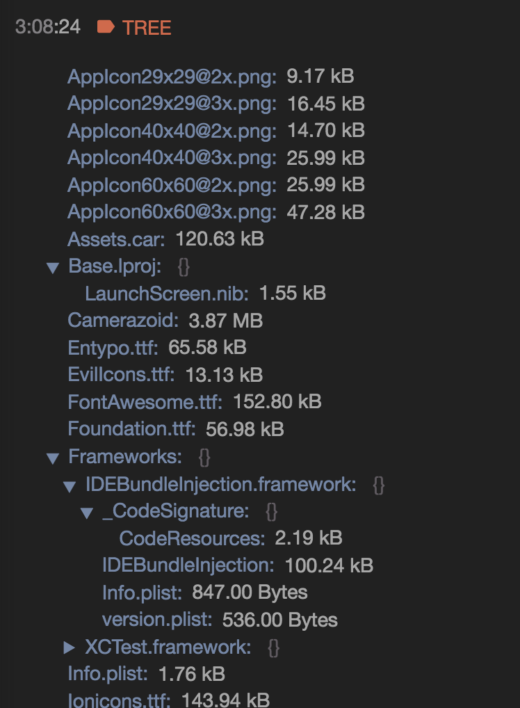
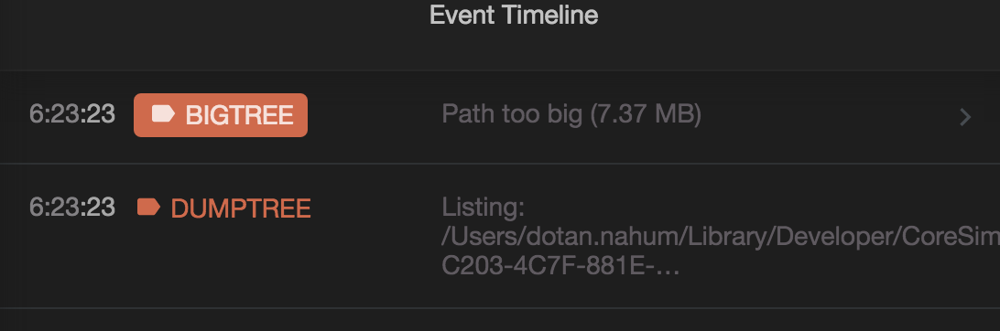

# React Native Filesystem Walker

Use this to walk a React Native filesystem (iOS or Android) and more specifically:

* Avoid blowing up disk usage
* Detect runaway files (temp files)
* Overview a live phone file system, or send off to things like Fabric.
* Implement custom walkers to filter and / or process specific files throughout
  the file system hierarchy.

## Quick Start

Currently `walker` supports a [react-native-fs](https://github.com/johanneslumpe/react-native-fs) backend, so you'll need to install that.

```
$ npm i -D react-native-fs-walker
$ npm i -S react-native-fs
```

In a suitable place in your code (either on boot, or triggered when you like):

```javascript
import RNFS from 'react-native-fs'
import walker from 'react-native-fs-walker'

const walk = walker(RNFS)

// let's get a tree dump of our temp folder:

let temps = {}
walk(RNFS.TemporaryDirectoryPath, temps)
  .then(()=>console.log("TEMP", temps))

```

You'll get something like this:


```
'TEMP', { 
  '.DS_Store': '6.15 kB',
  '04D017B5-8DCC-48AF-B512-91552ABE6E9D-16807-0000EB0B4B3F101D.jpg': '160.69 kB',
  '6D72B16A-022F-436B-994B-4D9A2B7C98B4-16807-0000EB0B5296448D.jpg': '169.16 kB',
  '9E34CE7E-5137-41BE-BF9F-CF6D4BB9D0FB-16807-0000EB0B5A03564A.jpg': '169.04 kB',
  'B5CEE5FA-489F-45D4-9788-AE26DF8D4890-16807-0000EB0B401CDD43.jpg': '162.33 kB',
  ReactNative: {} 
}
```

You can also try other root paths, anything that's available with [RNFS](https://github.com/johanneslumpe/react-native-fs):

```javascript
let bundle = {}
walk(RNFS.MainBundlePath, bundle)
  .then(()=>console.log("BUNDLE", bundle))

// and then, let's see what we save in our documents;

let docs = {}
walk(RNFS.DocumentDirectoryPath, docs)
  .then(()=>console.log("DOCS", docs))
```


## Reactotron

If you're using [Reactotron](https://github.com/reactotron/reactotron), then all you
need to do is this:


```javascript
import tronwalker from `react-native-fs-walker/tron`
Reactotron.use(tronwalker(RNFS))


// somewhere around your code:
Reactotron.dumpTree(RNFS.DocumentDirectoryPath)
```

You'll get something like this:



You can also use big tree detection with `bigTree`:

```javascript
import tronwalker from `react-native-fs-walker/tron`
Reactotron.use(tronwalker(RNFS))


// Show a warning if documents in total reached over 10MB
Reactotron.bigTree(RNFS.DocumentDirectoryPath, 10000000) // 10MB
```

If you're hogging the user's storage, you'll get something like this:




## console.log

You can use a simple `console.log` dumper to visualize the file tree:

```javascript
import consoleVisitor from `react-native-fs-walker/console`

walk(RNFS.DocumentDirectoryPath, consoleVisitor)
  .then(()=>console.log("done listing."))
```

You'll get something like this:

```
2016-08-26 17:34:40.527 [info][tid:com.facebook.react.JavaScript] AppIcon29x29@2x.png
2016-08-26 17:34:40.528 [info][tid:com.facebook.react.JavaScript] AppIcon29x29@3x.png
2016-08-26 17:34:40.528 [info][tid:com.facebook.react.JavaScript] AppIcon40x40@2x.png
2016-08-26 17:34:40.528 [info][tid:com.facebook.react.JavaScript] AppIcon40x40@3x.png
2016-08-26 17:34:40.528 [info][tid:com.facebook.react.JavaScript] AppIcon60x60@2x.png
2016-08-26 17:34:40.528 [info][tid:com.facebook.react.JavaScript] AppIcon60x60@3x.png
2016-08-26 17:34:40.529 [info][tid:com.facebook.react.JavaScript] Assets.car
2016-08-26 17:34:40.529 [info][tid:com.facebook.react.JavaScript] Base.lproj
2016-08-26 17:34:40.535 [info][tid:com.facebook.react.JavaScript]   LaunchScreen.nib
2016-08-26 17:34:40.535 [info][tid:com.facebook.react.JavaScript] Camerazoid
2016-08-26 17:34:40.535 [info][tid:com.facebook.react.JavaScript] Entypo.ttf
2016-08-26 17:34:40.536 [info][tid:com.facebook.react.JavaScript] EvilIcons.ttf
2016-08-26 17:34:40.536 [info][tid:com.facebook.react.JavaScript] FontAwesome.ttf
2016-08-26 17:34:40.536 [info][tid:com.facebook.react.JavaScript] Foundation.ttf

```

You can use the `bigTree` feature as well, to pop a YellowBox:

```javascript
import bigtree from 'react-native-fs-walker/console-big-tree'
const consoleBigTree = bigtree(RNFS)

//then call this where ever you like:
consoleBigTree(RNFS.MainBundlePath, 100000)
```

You'll see something like this:


## Advanced

Let's see how to implement the `bigTree` functionality from scratch.

This means building a visitor that will sum up all sizes of all of the files and
having a threshold in place:

```javascript
import sizing from 'react-native-fs-walker/sizing'
let sizes = {}
walk(RNFS.TemporaryDirectoryPath, sizing(sizes))
  .then(()=>sizes.total > 100000 && console.warn("BIG TREE", sizes.htotal))
```

## Summary

Here's everything you can do, in one stroke:

```javascript
const walk = walker(RNFS)
const consoleBigTree = bigtree(RNFS)

//using simple console
walk(RNFS.MainBundlePath, consoleVisitor)
  .then(()=>{})
  .catch((err)=>console.log(err))

//using tron
let tree = {}
walk(RNFS.MainBundlePath, tree)
  .then(()=>Reactotron.display({name:'TREE', preview: 'listing', value: tree}))
  .catch((err)=>console.log(err))

//using raw object
const temps = {}
walk(RNFS.TemporaryDirectoryPath, temps)
  .then(()=>console.log("TEMP", temps))

//detect big tree
consoleBigTree(RNFS.MainBundlePath, 100000)

//using the tron plugin
Reactotron.dumpTree(RNFS.MainBundlePath)
Reactotron.bigTree(RNFS.MainBundlePath, 100000)
```


# Contributing

Fork, implement, add tests, pull request, get my everlasting thanks and a respectable place here :).


### Thanks:

To all [Contributors](https://github.com/jondot/rn-snoopy/graphs/contributors) - you make this happen, thanks!


# Copyright

Copyright (c) 2016 [Dotan Nahum](http://gplus.to/dotan) [@jondot](http://twitter.com/jondot). See [LICENSE](LICENSE.txt) for further details.
